# 
App Preview Gallery

<h2>🏠 Home</h2>

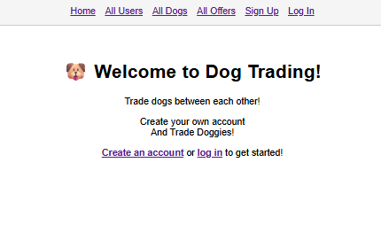

---

<h2>👥 All Users</h2>

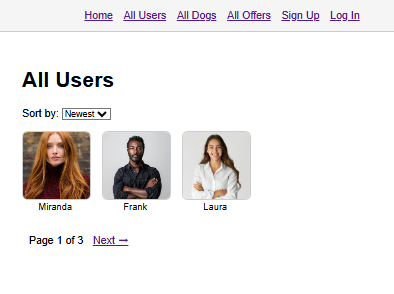

---

<h2>🐶 All Dogs</h2>

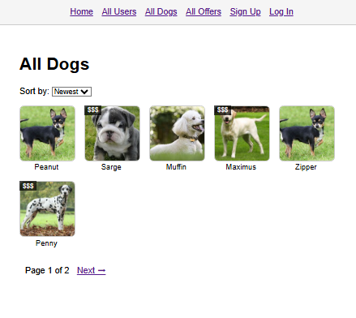

---

<h2>📦 All Offers</h2>

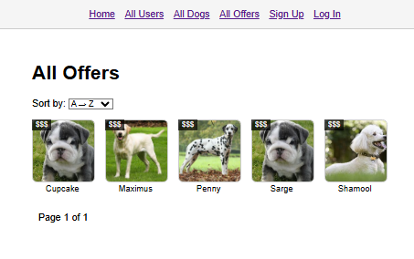

---

<h2>✍️ Sign Up</h2>

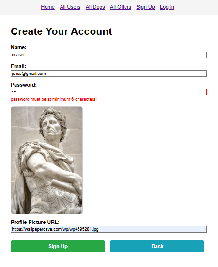

---

<h2>🔑 Login</h2>

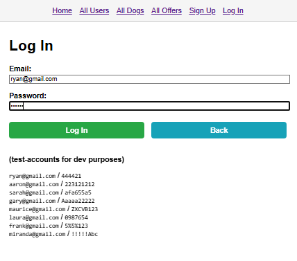

---

<h2>👤 My Profile</h2>

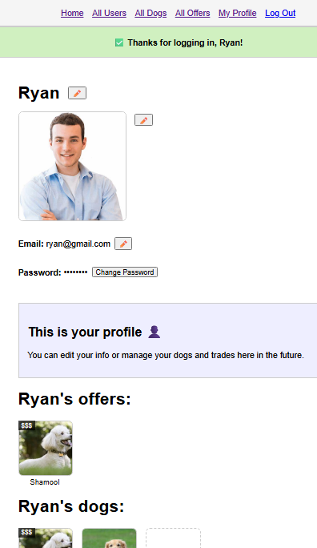

---

<h2>🎒 Inventory</h2>

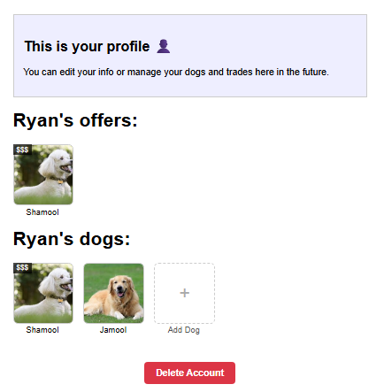

---

<h2>➕ Create Dog</h2>

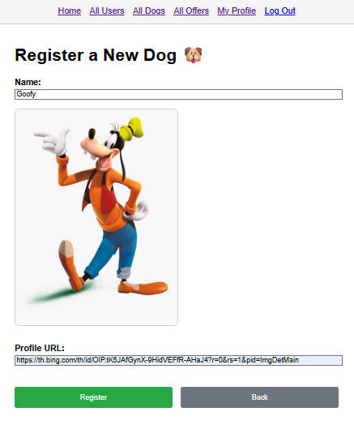

---

<h2>🐕 Dog Profile</h2>

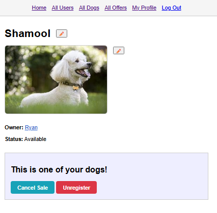

---

<h2>🛒 Buy Dog</h2>

---

<h2>✅ Bought Dog Confirmation</h2>

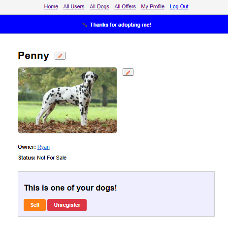

